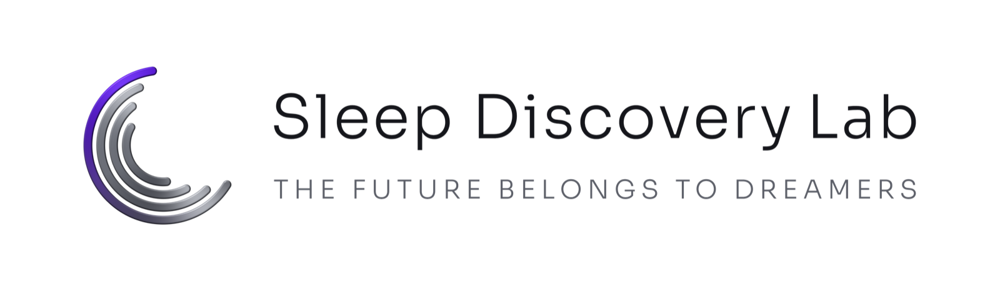

  <picture>
    <source media="(prefers-color-scheme: dark)" srcset="assets/logo_dark.png">
    
  </picture>

Computational sleep science from large-scale human sleep recordings and AI. 
<a href="https://sleepdiscovery.io">sleepdiscovery.io</a>

## Code

- [asd-sleep-architecture-children](https://github.com/sleepdiscovery/asd-sleep-architecture-children): sleep architecture of autistic and non-autistic children referred to four clinical sleep laboratories.
